<p align="center">
  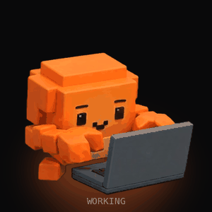
</p>

<h1 align="center">Sidebit</h1>

<p align="center"><b>A tiny desktop buddy for Claude Code and Codex.</b><br>
Bit types when your agent types, waves when it needs you, and quietly collects the story of your day.</p>

<p align="center">
  <a href="https://github.com/Solutionmax/sidebit/releases"></a>
  
  
  
  
  <a href="LICENSE"></a>
  <a href="https://buymeacoffee.com/solutionmax"></a>
</p>

<p align="center">
  <a href="#install">Install</a> ·
  <a href="#how-to-use-it">How to use it</a> ·
  <a href="#medals">Medals</a> ·
  <a href="#share-your-day">Share cards</a> ·
  <a href="#privacy">Privacy</a> ·
  <a href="#faq">FAQ</a>
</p>

<p align="center"><a href="https://github.com/Solutionmax/sidebit/releases/download/v0.8.0-beta.1/sidebit-launch.mp4">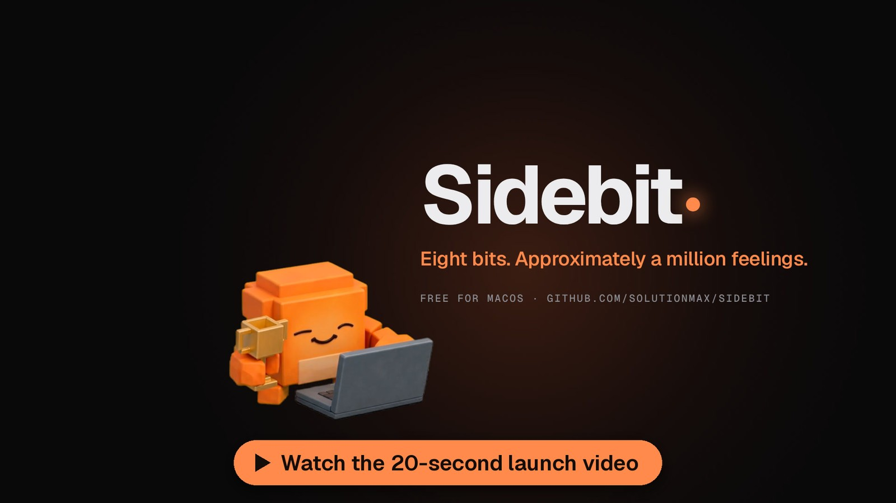</a></p>

> **Public beta.** Sidebit 0.8 is feature complete and in daily use, but it is new. Expect rough edges, and please [open an issue](https://github.com/Solutionmax/sidebit/issues/new/choose) when Bit does something odd.

---

## Meet Bit

Bit is a small voxel robot with a graphite laptop and a lot of opinions. It lives next to your work, follows every Claude Code and Codex session on your Mac, and reacts to what they are actually doing.

<p align="center">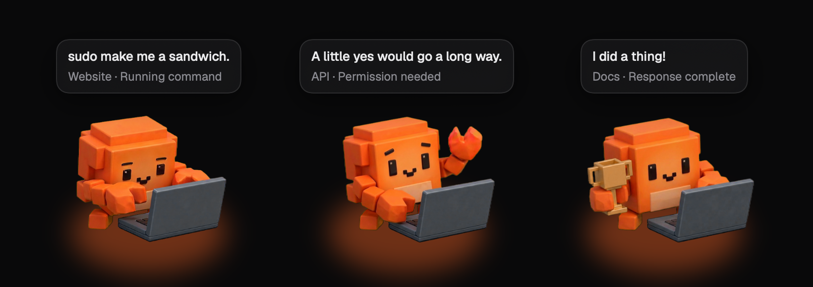</p>

- **It mirrors your agents.** Working, thinking, needs you, done and idle, each with its own animated scene. *Needs you* always wins, so Bit never hides a permission prompt behind a joke.
- **It reacts, and it is funny.** Running a command? *"sudo make me a sandwich."* A tool failed? *"Oops. Nobody saw that."* 2 AM? *"The bugs are nocturnal too."* Claude and Codex busy at once? *"Two agents, one tiny me."*
- **It gets your attention, politely.** When an agent is waiting, a black alert slides in under the menu bar with **Later** and **Open**, and the menu bar tells you who needs you.
- **It knows your limits.** Your real 5-hour and 7-day allowance as fuel lines, with an even-pace marker and a heads-up when you are running ahead: *"5 hours runs out around 20:40 at this pace."*
- **It remembers.** Every day becomes a small diary: turns, commands, edits, lines, your busiest hour and your streak. Keep it, or share it.
- **It is fun to play with.** Hold Bit to boop it. Drag it around and it complains. Leave it idle and it attempts a very serious coffee break.

<p align="center">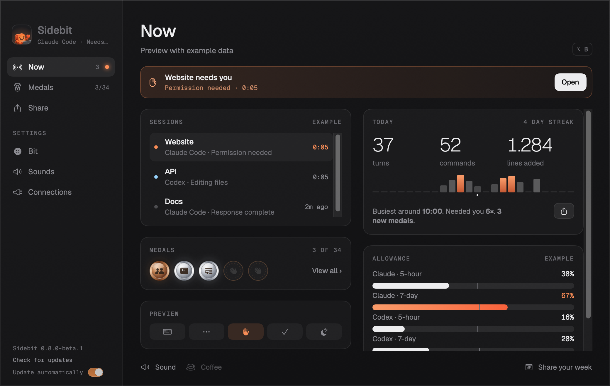</p>

<p align="center"><sub>One window for everything. Click Bit and it opens on <b>Now</b>; medals, share cards and settings sit in the sidebar.</sub></p>

## Install

**You need an Apple Silicon Mac (M1 or newer) with macOS 14 Sonoma or later.**

1. Download **`Sidebit-<version>-arm64.zip`** from the [latest release](https://github.com/Solutionmax/sidebit/releases).
2. Unzip it and drag **Sidebit.app** into **Applications**.
3. Open it. This build is signed with Sidebit's own certificate but not notarized by Apple, so the first time macOS may say it cannot verify the developer. Open **System Settings → Privacy & Security** and click **Open Anyway**.
4. Bit appears in the corner of your screen and says hi. Click **Connect Claude Code** and/or **Connect Codex**.
5. Start a **new** agent session. Codex asks you once to review and trust the new hooks (`/hooks`); Sidebit never bypasses that.

That's it. Updates arrive by themselves from now on: Sidebit checks this repository's releases and installs only archives that carry the project's signature.

<details>
<summary><b>Optional extras</b></summary>

- **Bit in your terminal.** *Settings → Connections → Show Bit below the Claude Code prompt* adds a line like `(•ᴗ•)⌨ Bit · sudo make me a sandwich. · 5h 42% · 7d 7%`. An existing status line (for example [ccstatusline](https://github.com/sirmalloc/ccstatusline)) keeps running above Bit and comes back exactly as it was when you turn this off.
- **Allowance on macOS.** Claude Code keeps its current sign-in in the Keychain. Turn on *Settings → Connections → Use Claude Code's sign-in from the Keychain*; Sidebit reads it the same way Claude Code does and never changes it.
- **Claude Desktop chat and Cowork.** *Settings → Connections → Desktop apps* follows the visible buttons of the Claude and Codex apps, with macOS Accessibility permission. Experimental.
- **Open at login**, companion size, sounds and reduced motion live under *Settings → Bit* and *Sounds*.

</details>

## How to use it

| You want to… | Do this |
| --- | --- |
| See all sessions, today's diary and your allowance | Click Bit, or press **⌥B** anywhere. The window opens on **Now** |
| Get a quick glance | Hover over Bit |
| Jump to the agent that needs you | Click **Open** in the alert or on **Now** |
| Make Bit happy | Hold the mouse on Bit for a second |
| Move Bit | Drag it anywhere; it remembers the spot |
| Browse your medals | **Medals** in the sidebar, or **View all** on Now |
| Share your day, week or a medal | **Share** in the sidebar: pick a card, then **Save PNG** or **Copy image** |

The menu bar icon is a small speech bubble with Bit's eyes. The eyes follow the state; text only appears when an agent needs you.

<p align="center">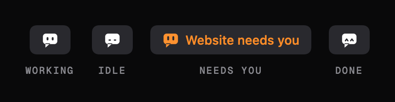</p>

## Medals

Sidebit counts what happens (never what is said) and turns it into **34 medals** in four metals: bronze, silver, gold and obsidian. Obsidian is for things almost nobody gets.

<p align="center"></p>

When you earn one, the coin flips in next to Bit with light rays and sparks, Bit lifts its trophy, and the medal joins your case, where it catches the light every few seconds. Locked medals are a faint stamp with a riddle, like *"Before the coffee"* or *"It no longer sparks joy"*.

<p align="center">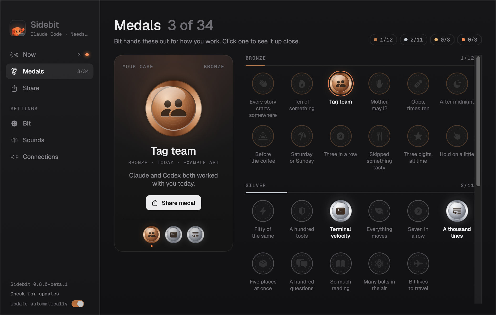</p>

<details>
<summary><b>See all 34 medals</b> (spoilers)</summary>
<p align="center">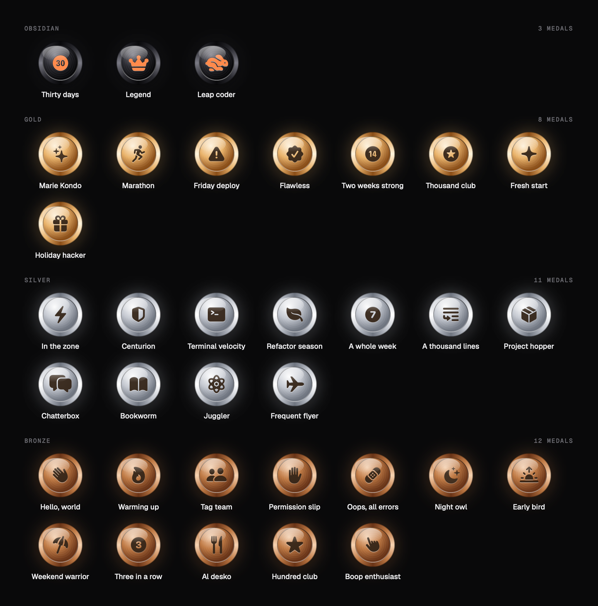</p>

A few favourites: **Friday deploy** (a command after 4 PM on a Friday, *brave, very brave*), **Marie Kondo** (you deleted more than you wrote), **Flawless** (20 turns without a single tool error), **Al desko** (coding right through lunch), **Leap coder** (29 February) and **Legend** (10,000 turns together). Booping and carrying Bit count too.
</details>

## Share your day

Every card is drawn on your Mac from local counts. Nothing is uploaded. Open **Share**, pick a card, and save or copy it right there.

<p align="center">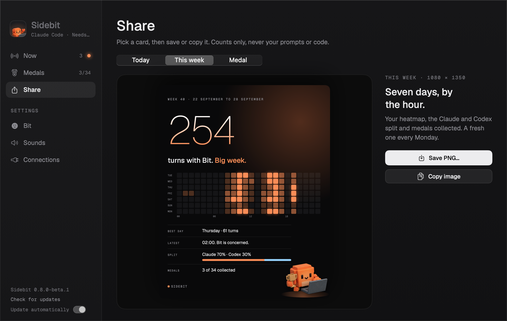</p>

<p align="center">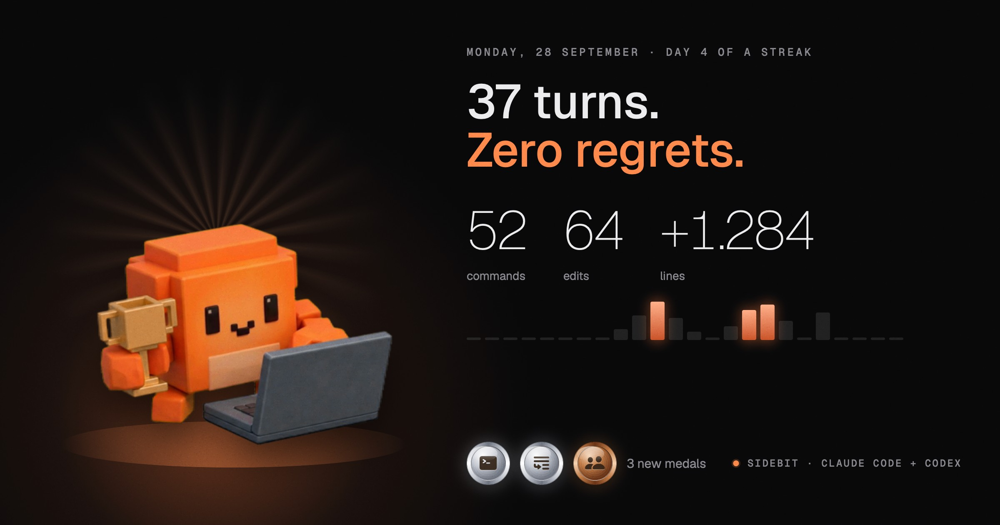</p>
<p align="center">
  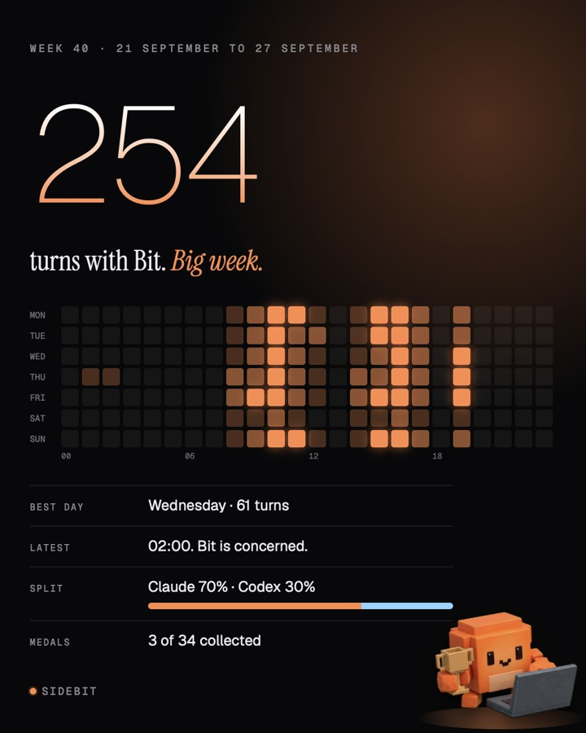
  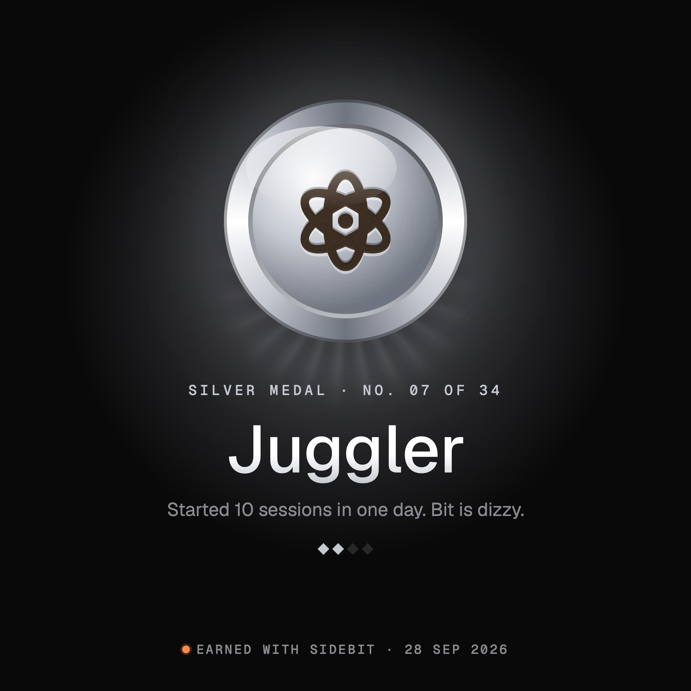
</p>

- **Today** (1200 × 630): the headline follows your day, from *"Zero regrets."* to *"Past midnight."*
- **Your week** (1080 × 1350): turns, a heatmap of your rhythm, best day, latest hour and the Claude and Codex split. Bit brings it up on Friday afternoon.
- **A medal** (1080 × 1080): pick a medal in your case and press **Share medal**.

## Coming soon: more companions

Bit is the first of a small cast. **Ember**, **Orbit** and **Mochi** are already sketched out, each with their own personality, and they will join in a feature update.

<p align="center">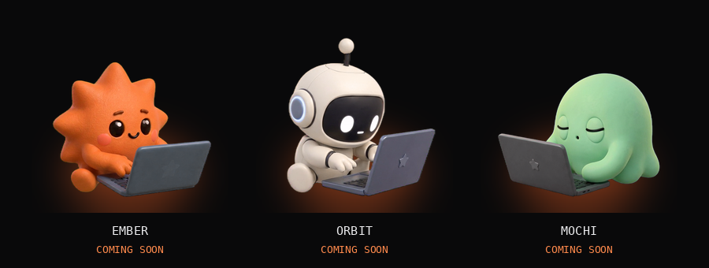</p>

## Works with

| | Through |
| --- | --- |
| Claude Code in the terminal, in IDE extensions, and the Code tab of Claude Desktop | Claude Code hooks |
| Codex CLI, the Codex app and the Codex IDE extension | Codex hooks |
| Claude Desktop chat and Cowork | Optional, experimental button detection |
| Browsers | Not supported, by design |

Agents must run on the same Mac. Sessions over SSH or on another machine are not forwarded.

## Privacy

Sidebit is local first. Everything it keeps lives in `~/Library/Application Support/Snipkin/`:

- **sessions:** provider, session ID, project folder, activity and time, plus process ID, app and model when available.
- **journal:** per-day **counts** (turns, tool runs by kind, permission requests, errors, events per hour, boops), project folder names, line totals from the status line, lifetime totals and your medals.
- **usage:** the last allowance reading per provider.

Sidebit never reads or stores prompts, replies, tool arguments, tool results or transcripts. There is no analytics and no Sidebit server.

Network requests are limited to: your allowance from `api.anthropic.com` or `chatgpt.com` using your existing CLI sign-in (at most every five minutes, and not at all while the Claude Code status line supplies it), and GitHub's public release API for updates. Connecting writes Sidebit's hooks to `~/.claude/settings.json` and `~/.codex/hooks.json` after saving a backup; **Disconnect** removes only Sidebit's hooks. Details: [usage sources](docs/usage-sources.md), [desktop detection](docs/desktop-detection.md).

**Updates** are signed with an Ed25519 key held by the maintainer. Sidebit verifies the signature, the bundle identifier and that the version is newer before it swaps itself, and discards anything else.

## FAQ

**Bit says "Unknown".** No event arrived for six hours, or the session runs where Sidebit cannot see it. Start a new session after connecting.

**The allowance is empty.** Turn on the Keychain option above. Some plans only report a weekly window. The status line source exists only for Claude Pro and Max, after the first response.

**Codex shows nothing.** Run `/hooks` in Codex and trust the Sidebit hooks.

**Bit stopped following Claude Desktop after an update.** From 0.7.0 beta 2 Sidebit is signed with a stable certificate, so macOS keeps the Accessibility permission across updates. Coming from beta 1, do this once: in *Privacy & Security → Accessibility* remove Sidebit with **–**, add it again with **+**, then restart Sidebit. Toggling is not enough.

**How do I remove it?** Settings → Connections → Disconnect both agents, quit, and delete the app. Your data folder is listed above.

## Build from source

```sh
swift test
./scripts/build-app.sh
python3 scripts/smoke-hooks.py dist/Sidebit.app
open dist/Sidebit.app --args --demo      # fictional example data
```

Swift 6, macOS 14 deployment target, no package dependencies. With `SIDEBIT_UPDATE_KEY` set, the build also signs the update; `swift scripts/update-sign.swift keygen` creates a key pair for a fork. More in [CONTRIBUTING.md](CONTRIBUTING.md), including how to add a medal or a quip in one line.

## Support

Sidebit is free and MIT licensed. If Bit made your day a little lighter, you can [buy me a coffee](https://buymeacoffee.com/solutionmax). Bit will balance it carefully.

---

<sub>Fonts: [Geist](https://github.com/vercel/geist-font) (Sans and Mono), SIL Open Font License. Inspired by [Codenotch](https://github.com/vinzdg/codenotch) and [ccstatusline](https://github.com/sirmalloc/ccstatusline); no code or assets were copied. Sidebit is an independent project and is not affiliated with Anthropic or OpenAI.</sub>
